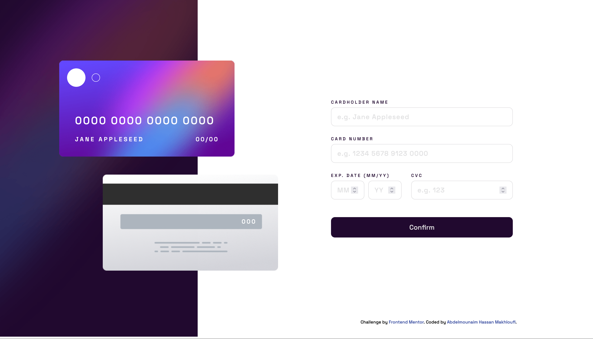
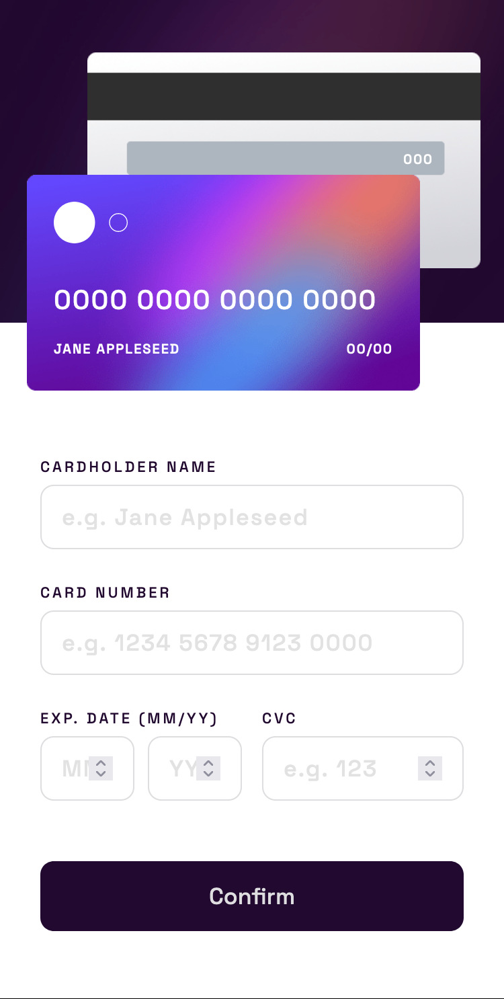

# Frontend Mentor - Interactive card details form solution

This is a solution to the [Interactive card details form challenge on Frontend Mentor](https://www.frontendmentor.io/challenges/interactive-card-details-form-XpS8cKZDWw).

## Table of contents

- [Overview](#overview)
  - [Screenshot](#screenshot)
  - [Links](#links)
- [My process](#my-process)
  - [Built with](#built-with)
  - [What I learned](#what-i-learned)
  - [Continued development](#continued-development)
  - [Useful resources](#useful-resources)
- [Author](#author)

## Overview

### Screenshot

### Links

- Solution URL: [Solution URL](https://github.com/HassanMak29/frontend-mentor-purchase-details)
- Live Site URL: [Live site URL](https://your-live-site-url.com)

## My process

### Built with

- Semantic HTML5 markup
- CSS custom properties
- Flexbox
- Desktop-first workflow

### What I learned

I learned form validation using vanilla Javascript. I also learned about more HTML5 tags and attributes.

### Continued development

I'm improving my Javascript skills (along with HTML5 and CSS3), since this is the first time I do solo projects where I had to think about the solutions by myself from scratch.

### Useful resources

- [ChatGPT](https://chat.openai.com/chat) - This helped me with regular expressions.

## Author

- Website - [Abdelmounaim Hassan Makhloufi](https://portfolio-hassan.netlify.app/)
- Frontend Mentor - [@HassanMak29](https://www.frontendmentor.io/profile/HassanMak29)
